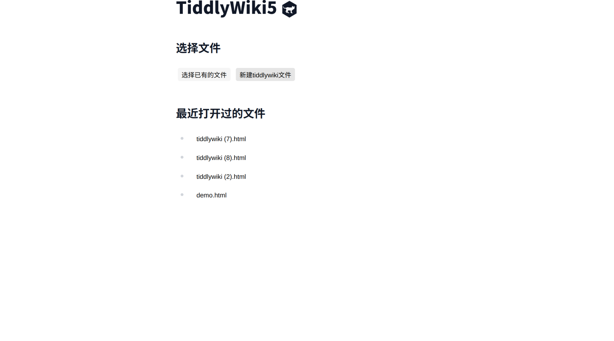

> 修改于 https://github.com/btheado/tiddlystow

> 使用 fileapi
> https://developer.mozilla.org/en-US/docs/Web/API/Window/showOpenFilePicker

> google chrome extension

> 默认支持tiddlywikicore-5.3.0.js

## TODO

- [x] 仅仅支持打开html
- [ ] support dark/light mode toggle with tailwindcss
- [ ] 支持拖动打开本地文件

## NOTE

* 不支持safari